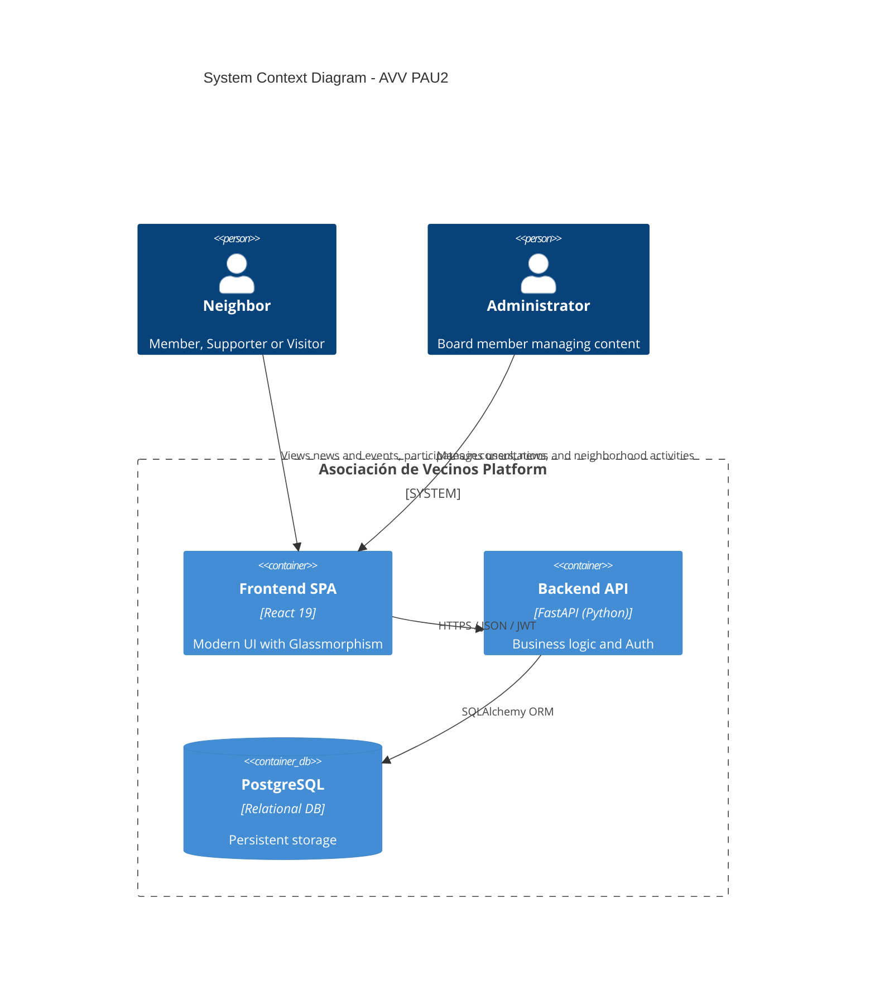
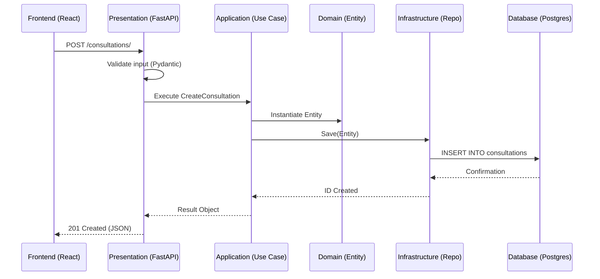
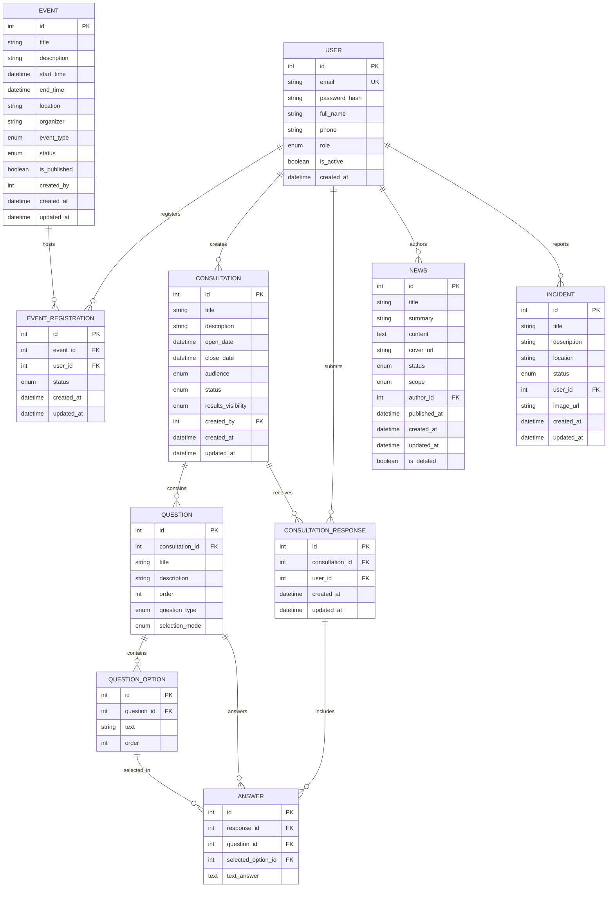

# AVV PAU2 Asociación de Vecinos

## Índice

0. [Ficha del proyecto](#ficha-del-proyecto)
1. [Descripción general del producto](#descripción-general-del-producto)
2. [Arquitectura del sistema](#arquitectura-del-sistema)
3. [Modelo de datos](#modelo-de-datos)
4. [Especificación de la API](#especificación-de-la-api)
5. [Historias de usuario](#historias-de-usuario)
6. [Tickets de trabajo](#tickets-de-trabajo)
7. [Pull requests](#pull-requests)

---
<a id="ficha-del-proyecto"></a>
## 0. Ficha del proyecto

### **0.1. Tu nombre completo:**
Cristina Cachero

### **0.2. Nombre del proyecto:**
AVV PAU2 Asociación de Vecinos

### **0.3. Descripción breve del proyecto:**
Plataforma web integral para la digitalización y gestión de comunidades de vecinos, facilitando la comunicación (noticias), participación (consultas democráticas), agenda (eventos) y administración de socios.

### **0.4. URL del proyecto:**
[http://localhost:5173](http://localhost:5173) (Entorno local de desarrollo)


### 0.5. URL o archivo comprimido del repositorio
[https://github.com/ccacheroc/AI4Devs-AsocVecinos-Antigravity](https://github.com/ccacheroc/AI4Devs-AsocVecinos-Antigravity) (Github)

---

<a id="descripción-general-del-producto"></a>
## 1. Descripción general del producto

### **1.1. Objetivo:**
El propósito de la aplicación es transformar la gestión tradicional de una asociación de vecinos en un proceso digital, transparente y participativo. Soluciona la fragmentación de la información y la baja participación ciudadana al centralizar noticias, votaciones y eventos en una única plataforma accesible para todos los vecinos.

### **1.2. Características y funcionalidades principales:**
- **Gestión de Usuarios y RBAC**: Sistema robusto de roles (Admin, Junta, Socio, Simpatizante) con acceso restringido por permisos.
- **Calendario de Eventos**: Publicación y gestión de actividades del barrio con control de visibilidad y confirmación de asistencia.
- **Consultas Vecinales**: Sistema de encuestas participativas con tipos de pregunta mixtos, anonimato garantizado y exportación de resultados para la toma de decisiones.
- **Gestión de Noticias**: Canal de comunicación oficial de noticias con editor de texto enriquecido y segmentación de audiencia (General vs Socios).
-  **Gestión de Incidencias**: Canal de comunicación oficial de incidencias con editor de texto enriquecido y segmentación de audiencia (General vs Socios).
- **Diseño Premium**: Interfaz moderna basada en *Glassmorphism* y animaciones sutiles para una experiencia de usuario superior.

### **1.3. Diseño y experiencia de usuario:**
La aplicación utiliza una estética "vibe-centric" con fondos dinámicos, gradientes suaves y componentes traslúcidos. 
- **Landing Page**: Un dashboard visual que resume las últimas noticias y eventos próximos.
- **Panel de Administración**: Herramientas potentes para la creación de contenido y gestión de la base de datos de usuarios.

### **1.4. Instrucciones de instalación:**
El proyecto está completamente dockerizado para facilitar su despliegue:

1. **Requisitos**: Docker y Docker Compose instalados.
2. **Despliegue**:
   ```bash
   docker compose up --build -d
   ```
3. **Migraciones y Semillas**: El sistema aplica automáticamente las migraciones. Para cargar datos iniciales de prueba:
   ```bash
   docker compose exec backend python seed_data.py
   ```
4. **Accesos**:
   - **Frontend**: `http://localhost:5173`
   - **Backend API**: `http://localhost:8000/docs`

---

<a id="arquitectura-del-sistema"></a>
## 2. Arquitectura del Sistema

### **2.1. Diagrama de arquitectura:**
El sistema sigue el patrón de **Arquitectura Hexagonal (Puertos y Adaptadores)**, lo que permite desacoplar la lógica de negocio de las tecnologías externas.

#### 2.1.1. Diagrama de Contexto


#### 2.1.2. Flujo de Petición (Hexagonal)


**Justificación**: Se eligió esta arquitectura para garantizar la **testabilidad** de la lógica de negocio sin depender de la base de datos o frameworks de presentación. El sacrificio inicial es una mayor complejidad en la estructura de carpetas, pero el beneficio es una mantenibilidad a largo plazo muy superior.

### **2.2. Descripción de componentes principales:**
- **Frontend**: React 19 con Vite, utilizando Vanilla CSS para un control total del diseño (inspirado en shadcn/ui).
- **Backend**: FastAPI 0.100+, aprovechando la validación asíncrona de Pydantic V2.
- **Persistencia**: SQLAlchemy 2.0 (ORM) sobre PostgreSQL 15.
- **Autenticación**: JWT con algoritmo asimétrico y hashing Argon2.

### **2.3. Descripción de alto nivel del proyecto y estructura de ficheros**
El repositorio está dividido en tres áreas principales:
- `backend/`: Código Python organizado en capas (Domain, Application, Infrastructure, Presentation).
- `frontend/`: Código React con arquitectura basada en features.
- `specs/`: Fuente de la verdad técnica (PRD, User Stories, Tickets, Planes de Implementación).

### **2.4. Infraestructura y despliegue**
El despliegue se gestiona mediante **Docker Compose**, orquestando tres contenedores: base de datos, API y cliente web. Se incluye salud del servicio (healthchecks) para asegurar que el backend no inicie hasta que la BD esté lista.

### **2.5. Seguridad**
- **Protección BOLA**: Verificación de autoridad sobre cada recurso en el servidor.
- **JWT**: Tokens de corta duración con rotación dinámica.
- **Sanitización**: Prevención de inyecciones XSS en el renderizado de noticias y consultas.
- **Audit Logging**: Registro de acciones críticas de administración.

### **2.6. Tests**
- **Unitarios (Backend)**: Pruebas de lógica de dominio y casos de uso con Pytest.
- **Integración**: Pruebas de los repositorios SQLAlchemy contra bases de datos en memoria/contendores.
- **E2E (Frontend)**: Flujos críticos (Login, Registro, Votación) probados con Playwright.

---
<a id="modelo-de-datos"></a>
## 3. Modelo de Datos

### **3.1. Diagrama del modelo de datos:**



### **3.2. Descripción de entidades principales:**
- **User**: Usuarios con roles jerárquicos. El campo `role` determina el nivel de acceso (RBAC).
- **News**: Entradas de blog que pueden ser de ámbito general o restringidas a socios.
- **Consultation**: Encuestas complejas con estados (Borrador, Abierta, Cerrada).
- **Event**: Calendario con visibilidad segmentada.

---
<a id="especificación-de-la-api"></a>
## 4. Especificación de la API

### **1. Inicio de Sesión**
`POST /auth/login`
- **Petición**: `{ "email": "user@example.com", "password": "..." }`
- **Respuesta**: `{ "access_token": "...", "token_type": "bearer" }`

### **2. Listado de Noticias**
`GET /news?status=PUBLISHED`
- **Descripción**: Retorna noticias filtradas por el rol del usuario autenticado (RBAC).
- **Respuesta**: Listado de objetos `News` con título, resumen y URL de portada.

### **3. Envío de Respuesta a Consulta**
`POST /consultations/{id}/responses`
- **Seguridad**: Solo Socios/Simpatizantes autenticados. Máximo 1 respuesta por usuario.

> La especificación detallada de todos los endpoints implementados se encuentra en los archivos `feature-descr.md` de cada módulo en el directorio [specs/features/](./specs/features/).


---
<a id="historias-de-usuario"></a>
## 5. Historias de Usuario

**Historia de Usuario 1: Autenticación Segura (UM-USER-001)**
> Como **Vecino Registrado**, quiero **iniciar sesión** con mis credenciales para **acceder a las funciones exclusivas** de mi rol (socios/junta).

**Historia de Usuario 2: Información del Barrio (NM-USER-001)**
> Como **Vecino**, quiero **ver una lista de noticias relevantes** del barrio para **estar informado** de lo que ocurre en mi comunidad.

**Historia de Usuario 3: Votación Democrática (NC-MEMBER-002)**
> Como **Socio**, quiero **poder responder a las consultas abiertas** para **participar activamente** en la toma de decisiones del barrio.

> El listado completo de historias de usuario implementadas y sus criterios de aceptación puede consultarse en [specs/UserStories.md](./specs/UserStories.md) y en los documentos específicos de cada funcionalidad en [specs/features/](./specs/features/).


---
<a id="tickets-de-trabajo"></a>
## 6. Tickets de Trabajo

**Ticket 1: Modelo de Datos de Noticias (NM-ADMIN-001-DB-T01)**
> **Descripción**: Crear la migración de Alembic para la tabla `news` incluyendo campos para título, contenido (HTML), estado y visibilidad.
> **Done Criteria**: Migración aplicada en el contenedor de BD y modelo SQLAlchemy sincronizado.

**Ticket 2: API de Creación de Noticias (NM-ADMIN-001-BE-T02)**
> **Descripción**: Implementar el Caso de Uso `CreateNews` y el endpoint en la capa de presentación. Debe verificar rol de ADMIN.
> **Done Criteria**: Test de integración pasando y endpoint documentado en Swagger.

**Ticket 3: Interfaz de Gestión de Noticias (NM-ADMIN-001-FE-T03)**
> **Descripción**: Crear el formulario reactivo para la creación de noticias con soporte para imágenes de portada.
> **Done Criteria**: Estética alineada con la marca y feedback visual al guardar (toasts).

> El listado completo de tickets implementados y sus planes de implementación puede consultarse en  los documentos específicos de cada funcionalidad en [specs/features/](./specs/features/).

---
<a id="pull-requests"></a>
## 7. Pull Requests

En general, la regla de git-conventions.md  pide que se cree un pull request por cada feature implementado. No obstante, el refinamiento que han ido sufriendo reglas, skills y workflows durante el proyecto ha hecho que se hayan creado más pull requests de los previstos, y no siempre alineados con esta regla. 


